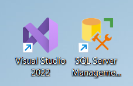
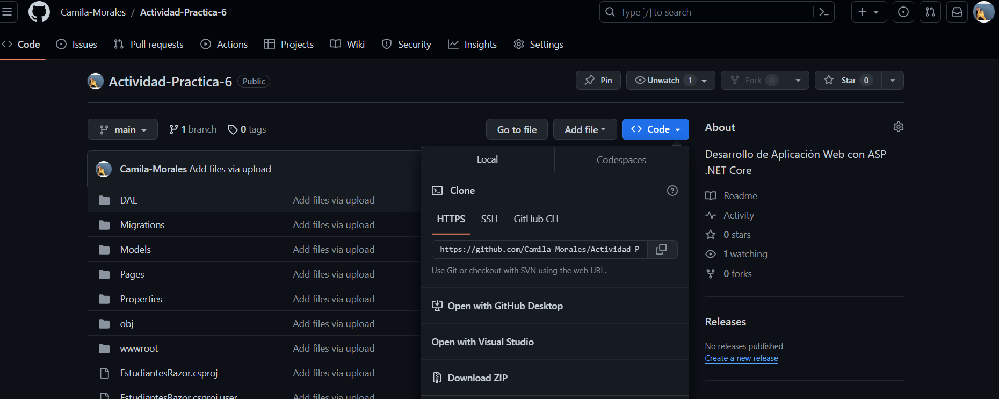
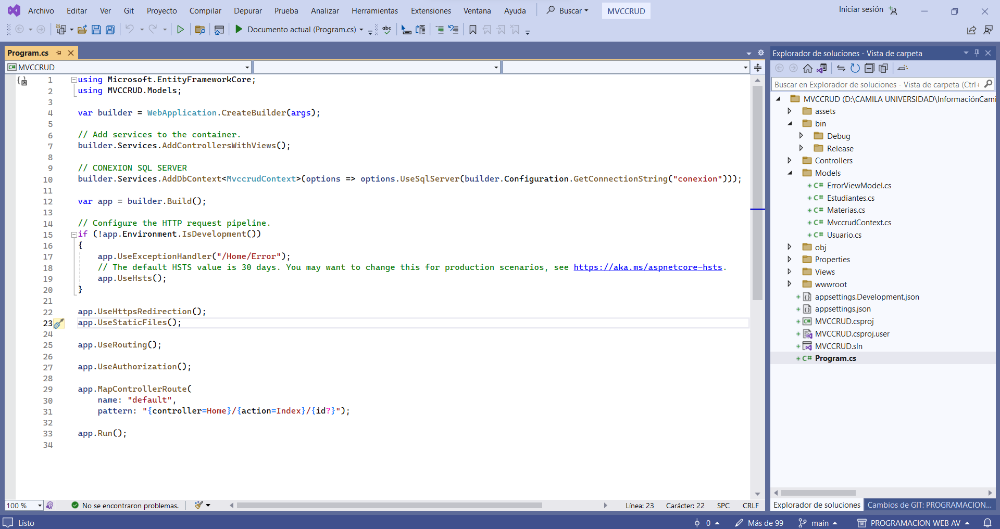
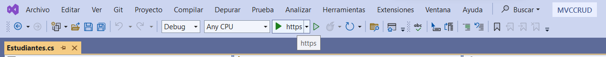

# MVC - CRUD

## REQUISITOS 
1. Instalar el Visual Studio 2022 
2. SDK net.8
3. Instalar SQL Server Management

 

## PASOS

### INSTALACION Y EJECUCION 
1. Descargar del repositorio de GitHub 
 

2. Abrir en la herramienta Visual Studio 2022
 

3. Presionar el boton de `EJECUTAR` en la herramienta Visual Studio 
 

4. Interactuar con la pagina web

